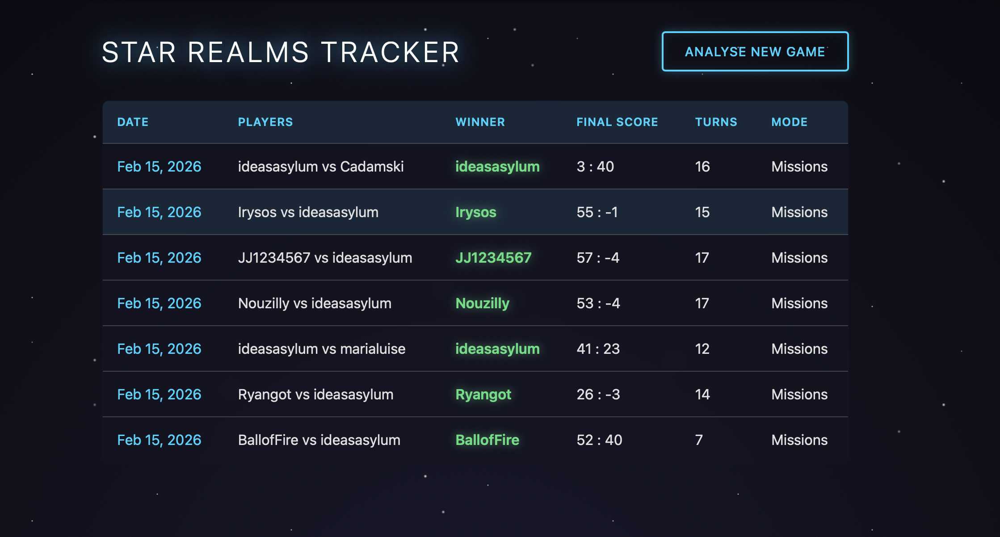
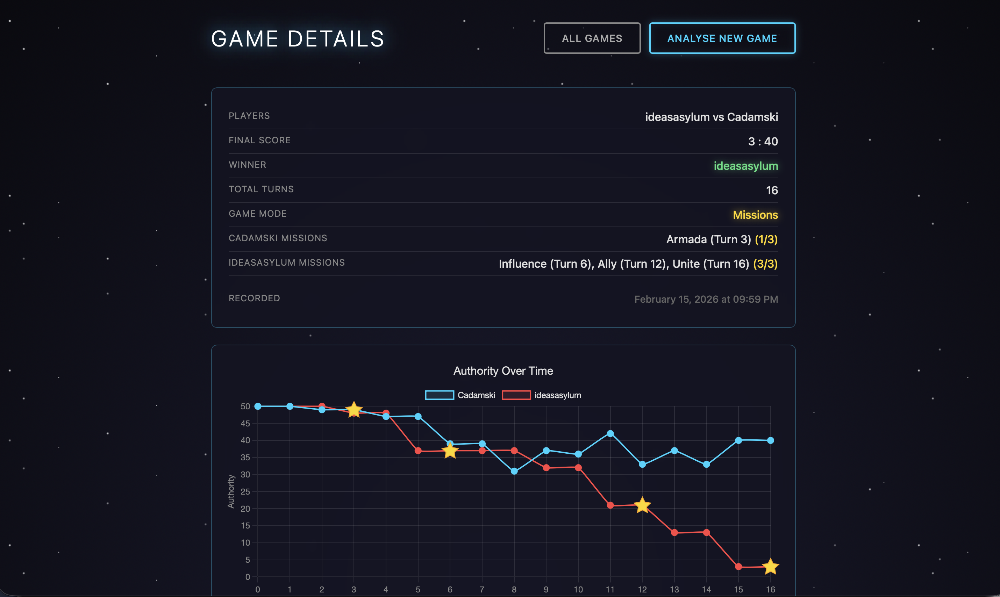
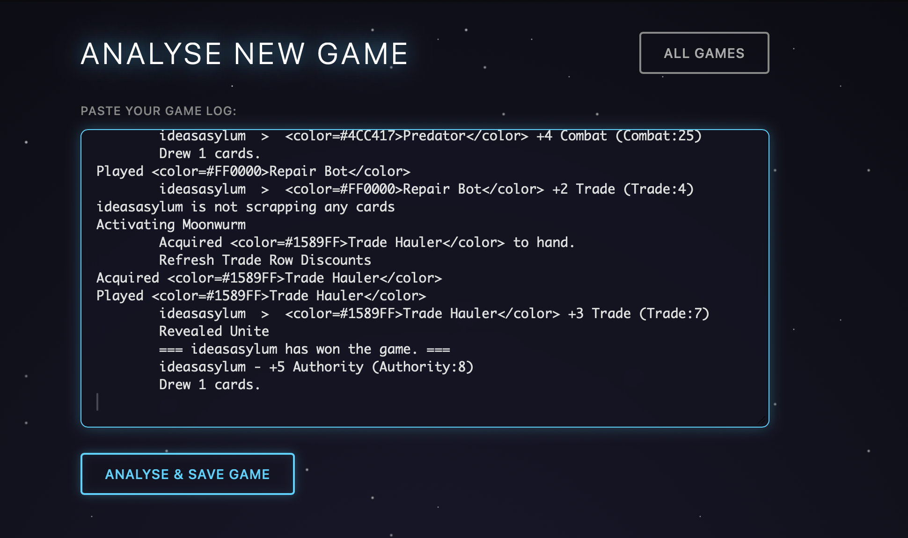

# Star Realms Tracker

A Ruby on Rails application for analysing and visualizing Star Realms game logs. Paste your game log to see authority progression, deck composition, and mission completions as interactive charts.



## Features

- **Log Analysis**: Extracts player names, turn counts, authority changes, and winner from Star Realms game logs
- **Authority Tracking**: Tracks both authority losses (from attacks) and gains (from cards like Federal Transport)
- **Deck Tracking**: Monitors card acquisitions and scraps by faction (Trade Federation, Blob, Star Empire, Machine Cult, Neutral)
- **Mission Support**: Detects mission game mode and tracks mission completions with star markers on the chart
- **Game Persistence**: Stores complete game logs and parsed stats for historical tracking
- **Re-parsing**: Stored logs can be re-parsed as the parser improves
- **Interactive Charts**: Authority and deck size progression using Chart.js
- **Space Theme**: Futuristic UI with animated starfield background and neon accents
- **Mobile Responsive**: Fully responsive design for phones and tablets
- **Winner-First Display**: Winner and their score always displayed first



## Screenshots

### Analyse New Game
Paste your game log from Star Realms to analyse it:



### Game Details
View authority progression, deck growth, mission completions, and final deck composition:


### Game History
Track all your games with players, scores, and outcomes:


## Requirements

- Ruby 4.0.1
- Rails 8.1
- SQLite3

## Local Development

```bash
# Clone the repository
git clone git@github.com:ideasasylum/star-realms-tracker.git
cd star-realms-tracker

# Install dependencies
bundle install

# Setup database
bin/rails db:setup

# Start the server
bin/rails server
```

Visit `http://localhost:3000` to use the application.

## Deployment

This application is configured for deployment with [Kamal](https://kamal-deploy.org/) to a Hetzner server.

### Prerequisites

- Docker installed locally
- GitHub CLI (`gh`) authenticated
- SSH access to the server (37.27.67.242)
- DNS A record pointing `startracker.ideasasylum.com` to the server IP

### Deploy

```bash
# First time setup (provisions server, sets up Docker, deploys)
bin/kamal setup

# Subsequent deployments
bin/kamal deploy

# View logs
bin/kamal logs

# Open Rails console
bin/kamal console

# SSH into container
bin/kamal shell
```

### Configuration

- **Server**: 37.27.67.242 (shared with WombatWorkouts)
- **Registry**: ghcr.io/ideasasylum/startracker
- **SSL**: Auto-provisioned via Let's Encrypt
- **Proxy**: Traefik for multi-app routing

Secrets are managed via:
- `RAILS_MASTER_KEY` from `config/master.key`
- `KAMAL_REGISTRY_PASSWORD` from GitHub CLI (`gh auth token`)

## Usage

1. Click "Analyse New Game" from the home page
2. Copy your game log from Star Realms (the complete log output)
3. Paste it into the text area
4. Click "Analyse & Save Game" to see:
   - Players and final scores (winner first)
   - Total turns played
   - Mission completions (for mission mode games)
   - Authority chart with mission completion stars
   - Deck size progression over time
   - Final deck composition by faction
5. The game is automatically saved and appears in your game history

## How to Get Game Logs

In the Star Realms app:
1. During or after a game, access the game log
2. Copy the entire log text
3. Paste into the tracker

## Architecture

```
app/
├── controllers/
│   └── games_controller.rb       # CRUD actions for games
├── models/
│   └── game.rb                   # Game persistence and re-parsing
├── services/
│   └── star_realms/
│       ├── log_parser.rb         # Main parser with regex patterns
│       └── game_result.rb        # Data object for parsed results
└── views/
    └── games/
        ├── index.html.erb        # Game history list
        ├── show.html.erb         # Game details with charts
        └── new.html.erb          # Log input form
```

### Database Schema

```
games
├── log_text                 # Complete raw log for re-parsing
├── player_1_name
├── player_2_name
├── winner_name
├── player_1_final_authority
├── player_2_final_authority
├── total_turns
├── is_mission_game
└── timestamps
```

### Log Parser

The parser uses regex patterns to extract:

| Pattern | Purpose |
|---------|---------|
| `It is now {player}'s turn {N}` | Turn start detection |
| `{player} ends turn {N}` | Turn end (triggers state snapshot) |
| `{player} - -{N} Authority` | Direct authority loss |
| `{player} - +{N} Authority` | Direct authority gain |
| `Acquired <color=#{hex}>{card}</color>` | Card acquisition by faction |
| `Scrapped <color=#{hex}>{card}</color>` | Card scrap by faction |
| `Revealed {MissionName}` | Mission completion |
| `=== {player} has won the game` | Winner detection |

### Faction Colors

| Color Code | Faction |
|------------|---------|
| `#1589FF` | Trade Federation (Blue) |
| `#4CC417` | Blob (Green) |
| `#FFFF00` | Star Empire (Yellow) |
| `#FF0000` | Machine Cult (Red) |
| `#800080` | Neutral (Purple) |

### Supported Missions

Exterminate, Ally, Convert, Influence, Dominate, Rule, Unite, Colonize, Defend, Diversify, Armada

### GameResult Object

```ruby
result = StarRealms::LogParser.parse(log_text)

result.players           # => ["Player1", "Player2"]
result.authority_by_turn # => {"Player1" => [[0, 50], [1, 50], ...]}
result.deck_by_turn      # => {"Player1" => [[0, {neutral: 10, ...}], ...]}
result.deck_size_by_turn # => {"Player1" => [[0, 10], [1, 11], ...]}
result.final_deck(player)      # => {neutral: 7, blob: 4, ...}
result.final_deck_size(player) # => 17
result.winner            # => "Player2" or nil
result.total_turns       # => 16
result.missions_by_turn  # => {"Player1" => [[5, "Ally"]], ...}
result.mission_game?     # => true/false
```

## Running Tests

```bash
# Run all tests
bin/rails test

# Run parser tests only
bin/rails test test/services/star_realms/log_parser_test.rb

# Run controller tests
bin/rails test test/controllers/games_controller_test.rb
```

## Development

### Adding Support for New Log Formats

1. Add a sample log to `test/fixtures/files/`
2. Write tests for expected behavior in `log_parser_test.rb`
3. Add regex patterns to `LogParser` as needed
4. Run tests to verify

### Re-parsing Stored Games

Games store the complete raw log, so you can re-parse them when the parser improves:

```ruby
game = Game.find(id)
result = game.parsed_result  # Re-parses the stored log
```

### Code Style

```bash
bin/rubocop
```

## Known Limitations

- Only supports 2-player games
- Some edge cases in log formats may not be handled

## License

MIT
